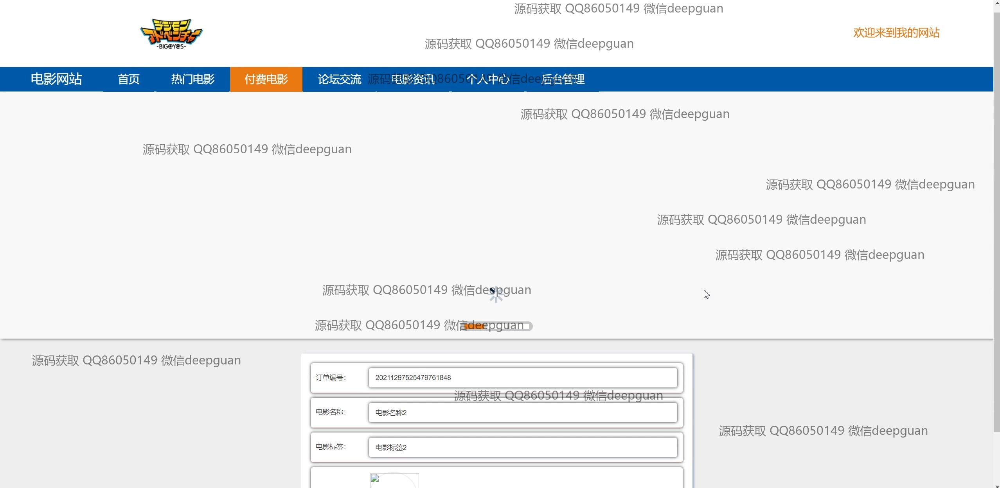

<h1 align="center">的电影网站付费免费vue</h1>

## 简介
电影管理系统：角色分为管理员、用户；功能包含电影分类管理、用户管理、订单管理、论坛交流、素材投稿、轮播图管理、视频播放等。    --计算机毕业设计源码；毕设源码；java毕业设计源码

## 联系方式

<h3 align="center">获取完整代码与数据库文件 + 微信：deepguan QQ: 86050149 QQ群: 783742310</h3>

<h3 align="center">可帮忙远程部署 包运行成功！提供远程部署、修改代码、设计文档指导、代码讲解等服务！</h3>

## 功能介绍（完整见运行截图）
管理员：基本功能包括登录、注册、退出。首页提供主导航栏、电影展示、分类筛选和新闻资讯，支持电影分类管理、用户管理、订单管理和素材投稿等后台操作。订单模块支持订单查询、资源附件上传及备注填写。电影管理模块支持添加和编辑电影信息，如名称、分类、标签、导演、演员、图片和预告片上传，提供电影列表及操作选项如详情、修改、删除。

用户：支持登录、注册、退出功能。首页提供热门电影、付费电影、论坛交流和资讯查看，用户可通过分类筛选、搜索框查找电影，点击详情查看影片信息和评论区互动。个人中心模块允许用户查看和修改个人信息、管理收藏夹以及查询历史订单。

游客：可浏览网站首页，包括电影分类展示、热门电影推荐、付费电影和新闻资讯等内容。支持影片信息查看和注册成为用户。论坛模块允许游客浏览热门帖子和社区讨论内容，但需登录后参与互动。

开发者：项目采用前后端分离，使用框架实现系统功能模块化，提供电影信息管理、用户管理、订单管理和论坛互动模块，支持资源的上传与管理，适合作为毕业设计或实际项目演示。

## 运行截图

本代码来源于网络,仅供学习参考使用!

